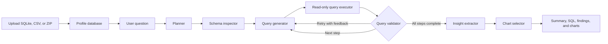

# InsightPilot

InsightPilot is a LangGraph-based data-analysis agent for SQLite and CSV data. It profiles an uploaded dataset, plans analytical questions, generates and validates read-only SQL, extracts findings from the returned rows, and renders Plotly charts in a Streamlit dashboard.

**Live app:** [insightpilot-data-analyst.streamlit.app](https://insightpilot-data-analyst.streamlit.app/)

The hosted dashboard uses a bring-your-own-key model. Each visitor can use OpenRouter (`openrouter/free` or a custom tool-capable model) or NVIDIA's `nvidia/nemotron-3.5-lightning-30b-a3b`. The app does not use an owner API key or include a preloaded dataset.

## What the app does

- Accepts `.db`, `.sqlite`, `.sqlite3`, `.csv`, and `.zip` uploads.
- Converts CSV files into a temporary SQLite database, with one table per CSV.
- Profiles tables, columns, row counts, declared foreign keys, and inferred relationships.
- Breaks a business question into two to four focused analysis steps.
- Generates SQLite `SELECT` or `WITH` queries grounded in the inspected schema.
- Executes queries through a read-only connection with a timeout and row limit.
- Retries invalid or unhelpful queries with validator feedback.
- Produces evidence-bound findings and Plotly charts.
- Keeps follow-up analysis in a visible Streamlit chat interface.

## Analysis workflow



The graph is assembled in `graph.py`. State moves between nodes through the `AgentState` types in `state.py`, while Pydantic models validate plans, queries, results, insights, and chart specifications.

## Model modes

### Hosted dashboard: visitor-supplied model key

The Streamlit dashboard defaults to OpenRouter. A visitor:

1. Chooses **OpenRouter** or **NVIDIA Nemotron** under **Your model** and pastes the matching API key.
2. For OpenRouter, selects the free router or supplies a custom model ID. The NVIDIA option uses `nvidia/nemotron-3.5-lightning-30b-a3b` via `https://integrate.api.nvidia.com/v1`.
3. Uploads a supported data file.
4. Starts the automatic overview and uses the chat for follow-up questions.

The key is stored only in that Streamlit session's server memory. It is not written to a file, environment variable, graph state, or saved result. Questions, schema information, sampled query results, and findings are sent to the selected provider. NVIDIA requires a valid NVIDIA API key and is subject to that account's limits.

### Local CLI: Ollama, OpenRouter, or NVIDIA

The CLI defaults to Ollama and uses `qwen2.5-coder:7b` for both coding and reasoning roles. It can also use an environment-configured OpenRouter or NVIDIA key.

## Project structure

```text
.
├── dashboard/
│   └── app.py                    # Streamlit upload, schema, overview, and chat UI
├── db/
│   ├── schema_profile.py         # Dashboard schema and relationship profiling
│   ├── setup_db.py               # Builds the local CLI/test fixture database
│   └── sample_data.csv           # Local CLI/test fixture
├── nodes/
│   ├── planner.py                # Question → analysis plan
│   ├── schema_inspector.py       # SQLite schema inspection for the graph
│   ├── query_generator.py        # Plan step → SQLite query
│   ├── query_executor.py         # Bounded read-only query execution
│   ├── query_validator.py        # Result validation and retry routing
│   ├── insight_extractor.py      # Query results → findings and summary
│   ├── chart_selector.py         # Tool-bound chart selection
│   └── utils.py                  # Shared node helpers
├── tools/
│   └── chart_tools.py            # Bar, line, pie, and scatter Plotly tools
├── tests/
│   ├── test_deployment.py        # Dashboard, credentials, and query-boundary tests
│   ├── smoke_nodes.py            # Non-LLM graph-node smoke tests
│   └── smoke_llm_nodes.py        # Mocked-LLM node smoke tests
├── .streamlit/
│   ├── config.toml               # Upload and Streamlit runtime settings
│   └── secrets.toml.example      # Optional deployment configuration example
├── graph.py                       # LangGraph topology
├── state.py                       # Shared TypedDict and Pydantic state models
├── prompts.py                     # LLM prompts
├── llm.py                         # OpenRouter/NVIDIA/Ollama clients and retry handling
├── main.py                        # Python API and CLI entrypoint
└── requirements.txt               # Python dependencies
```

## Run the dashboard locally

Python 3.10 or newer is required.

```bash
python -m venv .venv
source .venv/bin/activate
python -m pip install -r requirements.txt
streamlit run dashboard/app.py
```

On Windows PowerShell, activate the environment with:

```powershell
.\.venv\Scripts\Activate.ps1
```

Open `http://localhost:8501`, choose a provider, enter its API key in the UI, and upload a database or CSV file. No local secrets file is required for the default dashboard mode.

## Run the CLI

### Ollama

Install Ollama, pull the default model, and run a question:

```bash
ollama pull qwen2.5-coder:7b
python main.py "Summarize the most important trends" --db path/to/data.db
```

If `--db` is omitted, the CLI creates its local fixture database from `db/sample_data.csv`. This fixture is not available in the dashboard.

### OpenRouter

Set the provider and key in your shell, then run the same command:

```bash
export INSIGHTPILOT_LLM_PROVIDER=openrouter
export OPENROUTER_API_KEY=your_key_here
python main.py "Summarize the most important trends" --db path/to/data.db
```

### NVIDIA Nemotron

Set the provider and your NVIDIA API key in your shell. The CLI uses `nvidia/nemotron-3.5-lightning-30b-a3b` for both model roles by default:

```bash
export INSIGHTPILOT_LLM_PROVIDER=nvidia
export NVIDIA_API_KEY=your_key_here
python main.py "Summarize the most important trends" --db path/to/data.db
```

CLI results are printed to the terminal and written to `dashboard/latest_run.json`.

## Configuration

- `INSIGHTPILOT_LLM_PROVIDER`: `ollama` for the CLI default, `openrouter`, or `nvidia`. The dashboard offers OpenRouter and NVIDIA to visitors; `ollama` remains an owner-configured local option.
- `INSIGHTPILOT_CODER_MODEL`: coding and SQL model. Defaults to `qwen2.5-coder:7b` for Ollama, `openai/gpt-4.1-mini` for environment-configured OpenRouter, and `nvidia/nemotron-3.5-lightning-30b-a3b` for NVIDIA.
- `INSIGHTPILOT_REASONING_MODEL`: planning, insight, and chart-selection model. Uses the same provider-specific defaults.
- `OLLAMA_HOST`: Ollama endpoint. Defaults to `http://localhost:11434`.
- `INSIGHTPILOT_NUM_CTX`: Ollama context size. Defaults to `4096`.
- `INSIGHTPILOT_LLM_TIMEOUT`: model-call timeout in seconds. Defaults to `90`.
- `INSIGHTPILOT_LLM_ATTEMPTS`: application-level model attempts. Defaults to `2`.
- `INSIGHTPILOT_MAX_TOKENS`: hosted-model output-token limit. Defaults to `2048`.

## Upload and query boundaries

- A single upload is limited to 100 MB.
- A ZIP archive may contain one SQLite database or one or more UTF-8 CSV files, with at most 100 members.
- Total expanded ZIP content is limited to 250 MB.
- Archive paths are checked before extraction.
- Generated SQL must be one read-only `SELECT` or `WITH` statement.
- SQLite authorizer rules reject writes, attachment, and other unsafe operations.
- Query execution is limited to 10 seconds and 1,000 returned rows.
- The LLM receives at most the first 50 rows of each result for narrative findings.
- Query validation retries each step at most three times.

These controls reduce accidental or model-generated misuse. They are not a complete sandbox for hostile database files.

## Tests

The test suite does not require a live model key or Ollama server.

```bash
python -m unittest discover -s tests -p "test_*.py" -v
python -m tests.smoke_nodes
python -m tests.smoke_llm_nodes
```

## Deployment

The public app runs on Streamlit Community Cloud. It starts from `dashboard/app.py` and installs dependencies from `requirements.txt`. Visitors provide their own OpenRouter or NVIDIA key in the app. No dataset is preloaded in the dashboard.

## Known limitations

- The application analyzes one SQLite database per session and does not join across databases.
- CSV imports store values as text; SQLite conversions in generated queries may be needed for numeric or date analysis.
- Schema inspection intentionally avoids broad raw-data sampling, which can make ambiguous column meanings harder for the model to infer.
- Empty-result and suspicious-negative-value checks are heuristics and can retry a valid query.
- Session data and chat history are temporary and disappear when the session or Streamlit server is removed.
- Hosted-model capacity, tool support, pricing, and rate limits can vary by provider and account.

## Technology

LangGraph, LangChain, OpenRouter, NVIDIA API, Ollama, Streamlit, SQLite, Pydantic, Plotly, and Pandas.
