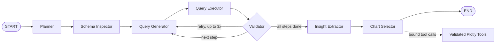

# InsightPilot

**Cloud deployment with OpenRouter is supported.** See [DEPLOYMENT.md](DEPLOYMENT.md) for Streamlit Community Cloud setup and the secrets template. The dashboard defaults to OpenRouter; set `INSIGHTPILOT_LLM_PROVIDER=ollama` to use a local model. Cloud mode sends questions, schema, sampled results, and findings to the configured provider. The local-only descriptions below apply to Ollama mode.

**InsightPilot** is an autonomous data-analyst agent built with **LangGraph**. Give it a natural-language business question and a SQLite database (or a CSV/ZIP upload), and it plans a small set of sub-questions, inspects the schema, writes and validates SQL, extracts evidence-based findings, and generates the right chart for each result — all running on a **local LLM** (via Ollama) so no data or query ever leaves the machine.

The full reasoning trail — plan, generated SQL, validation retries, findings, and charts — is rendered in an interactive **Streamlit** dashboard.

---

## Why this project

Most "text-to-SQL" demos stop at generating a single query. InsightPilot instead models the full analyst workflow as an explicit, inspectable state graph:

- **Multi-step planning** — one question is decomposed into 2–4 independently answerable sub-questions before any SQL is written.
- **Schema-grounded generation** — the SQL generator only ever sees the real, dynamically-inspected schema, never a hardcoded one.
- **Self-correction loop** — every query is executed and validated; failures (SQL errors, empty results, suspicious aggregates) feed back into the next generation attempt, up to 3 retries per step.
- **Evidence-bound insights** — the insight-extraction step is instructed to reason only from the actual returned rows, not to invent numbers.
- **Tool-bound charting** — the model never outputs chart data or code. It calls one of four strict LangChain tools with column names only; the tool itself builds the Plotly figure from the real query-result DataFrame. This removes an entire class of hallucinated-chart bugs.

---

## Architecture



| Node | Responsibility |
|---|---|
| **Planner** | Breaks the user's question into 2–4 concrete, independently-queryable sub-questions (LLM, JSON-structured output via Pydantic). Falls back to a generic 2-step plan if the local model is unavailable. |
| **Schema Inspector** | Reads table/column metadata directly from SQLite (via `PRAGMA table_info`, wrapped by LangChain's `SQLDatabase` toolkit). Sample rows are never included — only structure. |
| **Query Generator** | Writes one SQLite `SELECT`/`WITH` query per step, grounded in the real schema and any prior validation feedback. Rejects anything that isn't a single read-only statement before it reaches the database. |
| **Query Executor** | Runs the query against SQLite and captures columns, rows, or an error — nothing else touches the database. |
| **Query Validator** | Flags SQL errors, empty result sets, and suspicious negative aggregates. Routes back to the generator (with feedback) or forward, up to `MAX_QUERY_RETRIES`. |
| **Insight Extractor** | Turns each validated result set into short, evidence-based findings plus a one-line summary — explicitly instructed not to invent values. |
| **Chart Selector** | Binds a reasoning LLM to four Plotly tools (`make_bar_chart`, `make_line_chart`, `make_pie_chart`, `make_scatter_chart`). The model picks a tool and real column names only; the tool renders the actual figure from the query-result DataFrame. Falls back to a plain table if no valid chart can be built. |

State is passed between nodes as a single `AgentState` (TypedDict), with Pydantic models (`PlanStep`, `SQLQuery`, `QueryResult`, `Insight`, `ChartSpec`, etc.) used to validate the shape of each node's output before it's merged back in.

---

## Safety and design choices

- **SQL is constrained, not trusted.** Generated SQL must start with `SELECT`/`WITH`, contain no semicolons, and is rejected outright otherwise — before it ever reaches SQLite.
- **The LLM never touches raw chart data.** Chart generation is entirely tool-bound: the model can only choose a chart type and column names, never emit values, code, or a spec object. This is the single most important safety property of the pipeline.
- **Everything runs locally.** LLM calls go through Ollama (`qwen2.5-coder:7b` by default) — no external API calls, so it's safe to point at real/sensitive datasets.
- **Bounded retries everywhere.** LLM calls (`llm.py`) retry with backoff on transient failures; SQL generation retries on validation feedback up to `MAX_QUERY_RETRIES` (default 3) per step — the graph can't loop forever.
- **Errors are data, not exceptions.** Failures at any stage are captured into `state["errors"]` and surfaced in the dashboard's Diagnostics panel rather than crashing the run.

---

## Project structure

```
├── main.py                  # CLI entrypoint — runs the graph, writes dashboard/latest_run.json
├── graph.py                 # StateGraph assembly (nodes + edges + conditional routing)
├── state.py                 # AgentState TypedDict + Pydantic models shared across nodes
├── llm.py                   # Ollama client setup, retry wrapper for LLM calls
├── prompts.py                # All node prompts in one place
├── nodes/
│   ├── planner.py            # Question → 2-4 step plan
│   ├── schema_inspector.py   # Dynamic schema discovery
│   ├── query_generator.py    # Step → validated SQLite SELECT/WITH
│   ├── query_executor.py     # Executes SQL, captures rows/errors
│   ├── query_validator.py    # Validates results, drives the retry loop
│   ├── insight_extractor.py  # Result rows → evidence-based findings
│   ├── chart_selector.py     # Tool-bound chart type + column selection
│   └── utils.py               # JSON parsing / state helpers shared by nodes
├── tools/
│   └── chart_tools.py         # The 4 strict Plotly chart tools + ContextVar-scoped data binding
├── db/
│   ├── setup_db.py            # Builds the bundled demo SQLite DB from sample_data.csv
│   ├── schema_profile.py      # Table/relationship profiling for the dashboard's schema view
│   └── sample_data.csv        # Bundled "tech layoffs" demo dataset
├── dashboard/
│   └── app.py                  # Streamlit UI: upload data, view schema, chat with InsightPilot
├── tests/
│   ├── smoke_nodes.py           # Non-LLM node tests
│   └── smoke_llm_nodes.py       # Node logic tests with mocked LLM responses (no Ollama needed)
└── requirements.txt
```

---

## Setup

**1. Install Python 3.10+ and create a virtual environment**

```bash
python -m venv .venv
source .venv/bin/activate   # Windows: .venv\Scripts\activate
```

**2. Install dependencies**

```bash
pip install -r requirements.txt
```

**3. Install Ollama and pull the default local model**

```bash
ollama pull qwen2.5-coder:7b
```


**4. Run an analysis**

```bash
python main.py "Which industries had the highest layoffs in 2023?"
```

**5. Or launch the full dashboard**

```bash
python main.py "Which industries had the highest layoffs in 2023?" --dashboard
# or directly:
streamlit run dashboard/app.py
```

CLI runs write their state to `dashboard/latest_run.json`. The dashboard runs analyses independently and keeps each visitor's results in their own session.

---

## Using the dashboard

1. **Load data** — use the bundled tech-layoffs demo database, or upload your own `.db` / `.sqlite` / `.sqlite3` file, a `.csv`, or a `.zip` containing exactly one SQLite database or one-or-more UTF-8 CSV files. CSV uploads are converted into a temporary SQLite database (one table per file, safely-sanitized table/column names). Uploads are checked for valid SQLite headers, unsafe archive paths, too many files, and oversized archives before anything is written to disk.
2. **Automatic overview** — as soon as data loads, InsightPilot profiles the schema (tables, columns, inferred relationships) and runs one full analysis pass to give you a starting overview.
3. **Ask follow-up questions** — the chat box at the bottom runs the complete plan → SQL → validate → insight → chart pipeline against the loaded database for any question you type.

Dashboard uploads and demo databases are stored in separate temporary directories per session. They are not durable across restarts.

### Example questions

- *"Which industries had the highest layoffs in 2023?"* → ranked totals + distribution chart
- *"How did layoffs trend month by month in 2023?"* → monthly time series with peak call-outs
- *"Which regions and industries combine the highest layoffs with the most funding raised?"* → comparison table or scatter plot

---

## Configuration

Everything is tuned for a modest local GPU (6 GB VRAM) by default, and configurable via environment variables:

| Variable | Default | Purpose |
|---|---|---|
| `INSIGHTPILOT_CODER_MODEL` | `qwen2.5-coder:7b` | Model used for SQL generation |
| `INSIGHTPILOT_REASONING_MODEL` | `qwen2.5-coder:7b` | Model used for planning, insights, chart selection |
| `INSIGHTPILOT_NUM_CTX` | `4096` | Context window size passed to Ollama |
| `INSIGHTPILOT_LLM_TIMEOUT` | `90` | Per-call timeout (seconds) |
| `INSIGHTPILOT_LLM_ATTEMPTS` | `2` | Retry attempts per LLM call |

To trade some quality for speed, point the reasoning model at something smaller without touching source code:

```bash
ollama pull qwen2.5:3b
export INSIGHTPILOT_REASONING_MODEL=qwen2.5:3b
```

LLM calls are synchronous and strictly sequential by design — this avoids concurrent VRAM contention on single-GPU local setups.

---

## Known limitations

- The empty-result and negative-value validation checks are heuristics — a correct query with a genuinely empty or negative result can still trigger a (wasted) retry.
- Schema inspection currently only reads structure, not sample values, which keeps prompts small but can make the query generator less precise on ambiguous column semantics (e.g. free-text categorical columns).
- Everything assumes a single SQLite file; no multi-database joins.

---

## Tech stack

**LangGraph** · **LangChain** (`langchain-community`, `langchain-ollama`) · **Ollama** (local LLM serving) · **Pydantic** (structured I/O validation) · **SQLite** · **Plotly** · **Pandas** · **Streamlit**
